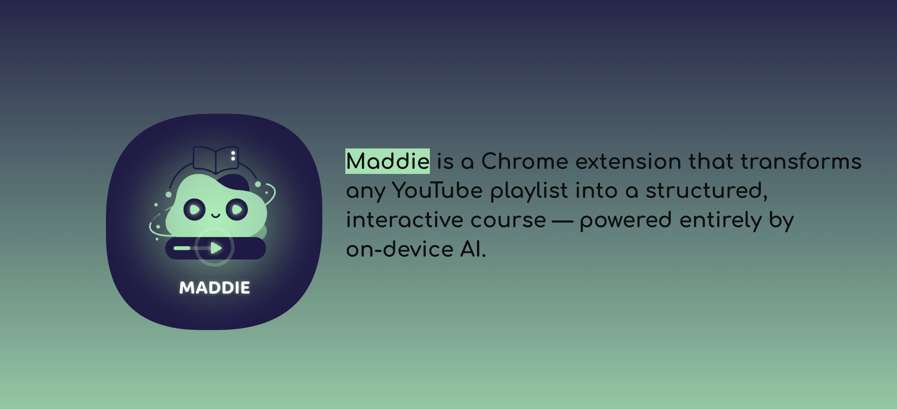

# Maddie — Your Personal AI Learning Companion for YouTube


Maddie is a Chrome extension that transforms any YouTube playlist into an interactive, private, and AI-powered course. She's your personal AI tutor, helping you learn faster and remember more by turning passive watching into active, engaged learning.

---

## 🚀 Key Features

-   🎓 **Enroll in Playlists**: Turn any YouTube playlist into a structured "course" with a single click.
-   🧠 **AI-Powered Notes**: Instantly generate concise, bullet-point summaries of any video using on-device AI.
-   📝 **Personalized Quizzes**: Test your knowledge with AI-generated multiple-choice quizzes based on the video's content.
-   💬 **Conversational Learning**: Chat with Maddie to clarify doubts, explore concepts, and get instant explanations grounded in the video's transcript.
-   🔐 **100% Private**: All AI processing happens **on your device** using Chrome's built-in Gemini Nano model. Your data never leaves your computer.
-   📊 **Dashboard**: Manage all your enrolled courses, track completed lessons, and revisit your study materials from a clean, efficient popup.


---

## 🛠️ Prerequisites & Installation

To get Maddie up and running, please follow these steps carefully.

### System Requirements

-   **Google Chrome:** Version **127** or newer (Stable, Beta, or Dev channel).
-   **Operating System:** Windows 10/11, macOS 13+, Linux, or ChromeOS (on Chromebook Plus).
-   **Hardware:**
    -   **GPU:** More than 4 GB of VRAM.
    -   **CPU:** 16 GB of RAM or more, with 4+ CPU cores.
-   **Storage:** At least **22 GB of free disk space** for the AI models.

> **Note:** The `LanguageModel` APIs and Gemini Nano are cutting-edge. These requirements ensure the models can be downloaded and run efficiently on your machine.

### Step 1: Enable Chrome's On-Device AI

1.  Open Chrome and navigate to `chrome://flags/#prompt-api-for-gemini-nano-multimodal-input` & `chrome://flags/#summarization-api-for-gemini-nano`.
2.  Select **"Enabled"** from the dropdown menu.
3.  Navigate to `chrome://flags/#optimization-guide-on-device-model`.
4.  Select **"Enabled BypassPerfRequirement"** from the dropdown. This is crucial to ensure the model downloads regardless of background performance checks.
5.  Click the **"Relaunch"** button at the bottom of the screen to apply the changes.

### Step 2: Download the Project

Clone the repository to your local machine:
```bash
git clone https://github.com/godmodevegeta/tubetutor-extension.git
```
Navigate into the project directory:
```bash
cd maddie-extension
```

### Step 3: Install Dependencies

This project uses Node.js and `npm` to manage dependencies and build the source code.
```bash
npm install
```

### Step 4: Run the Development Build

This command will compile the Svelte application and watch for any file changes, automatically rebuilding as you work.
```bash
npm run dev
```
This will create a `dist` folder in your project directory. This folder contains the final, compiled extension.

### Step 5: Load the Extension in Chrome

1.  Open Chrome and navigate to `chrome://extensions/`.
2.  Enable **"Developer mode"** using the toggle in the top-right corner.
3.  Click the **"Load unpacked"** button.
4.  In the file selection dialog, choose the **`dist`** folder that was created in the previous step.
5.  Maddie should now appear in your list of extensions, and her icon will be in your Chrome toolbar.

You're all set! Navigate to a YouTube playlist to start learning.

---

## 💡 How We Built It

Maddie is a modern Chrome extension built with a focus on privacy, performance, and a seamless user experience.

-   **Frontend Framework:** **Svelte 4**, chosen for its high performance, minimal bundle size, and proven stability in extension environments.
-   **On-Device AI:**
    -   **`Summarizer API` (`chrome.ai.summarize`)**: Used for the "Notes" feature to generate instant, high-quality key points.
    -   **`Prompt API` (`chrome.ai.prompt`)**: The core of our "Quiz" and "Chat" features, using a JSON schema for structured quiz output and a streaming, context-aware session for conversational learning.
-   **Architecture:**
    -   **`<iframe>` Sandbox:** The entire Svelte UI is injected into an `<iframe>` on YouTube pages. This provides a perfect, hermetically-sealed sandbox, completely bypassing YouTube's strict Content Security Policies (CSP) and `TrustedHTML` requirements.
    -   **Background Service Worker (`background.js`):** Acts as the central "brain." It manages all caching, orchestrates calls to the `chrome.ai` APIs, and handles data persistence in `chrome.storage.local`.
    -   **Content Script (`content.js`):** A lightweight script whose only jobs are to detect the correct context (playlist vs. video page) and inject the UI (`<iframe>` or "Enroll" button).
-   **Build Tool:** **Vite**, configured for a multi-entry-point extension build, ensuring a fast development loop and optimized output.

---

## 🏆 Accomplishments & Key Features

-   **Truly Private AI:** Successfully leveraged the `chrome.ai` APIs to deliver powerful generative features with zero server-side processing. This is a huge win for user privacy and a core part of the project's philosophy.
-   **Seamless Integration:** The `<iframe>` architecture provides a robust, crash-proof way to render a modern Svelte app inside a hostile third-party environment. The UI is themed to match YouTube and adapts to both light and dark modes.
-   **The "Socratic Loop":** The "Ask Maddie Why" feature creates a powerful, interactive learning loop between the Quiz and Chat tabs, demonstrating a deep, cohesive integration between the extension's features.
-   **Stateful & Persistent:** User data (enrolled courses, chat history, quizzes) is intelligently cached and persists across browser sessions, providing a continuous and reliable user experience.

---

> *"YouTube is the world's biggest classroom. Maddie is an attempt to give every student a personal tutor."*

---
